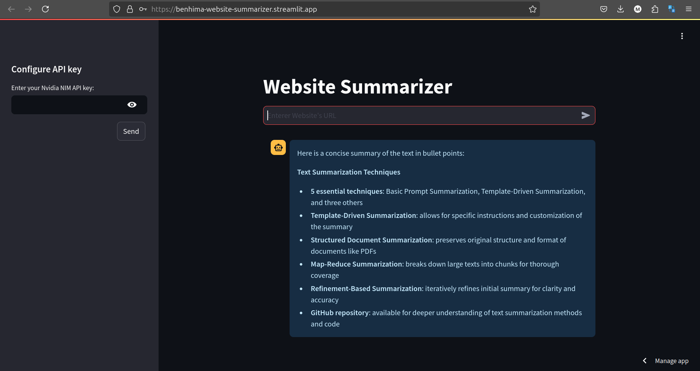

# Website Summarizer:

## Description:
this is a website summarizer that use llama3 70b instruct and NIM accelerator inference provided by NVIDIA. <br/>
here where you can get the [NIM NVIDIA api key](https://build.nvidia.com/explore/discover) <br/>

the method used for summary is **_map reduced_** method <br/>

Frameworks used in this projects:
- Lanchain: to build the pipeline that you give her the wesite's URL and NVIDIA NIM api key and return 
to you the response
- Langsmith: to monitor my LLM responses
- Streamlit: to build the front-end


## How to use it:
1. fork / clone this project
2. create virtual envirenment: <br/>
```sh
 python3 -m venv .venv
 ```
3. create an .env file: <br/>
 ```sh
 touch .ven
 ```
 - Add `LANGCHAIN_PROJECT` and `LANGCHAIN_API_KEY` environment variables.
4. install the requirements: <br/>
```sh
pip install -r requirements.txt
```
5. run the website: <br/>
```bash
streamlit run main.py
```
## Website Demo

[try the tool for free](https://benhima-website-summarizer.streamlit.app/)

### Contact me:
for more information or issues here is my email:
benhima.mohamed.amine@gmail.com
